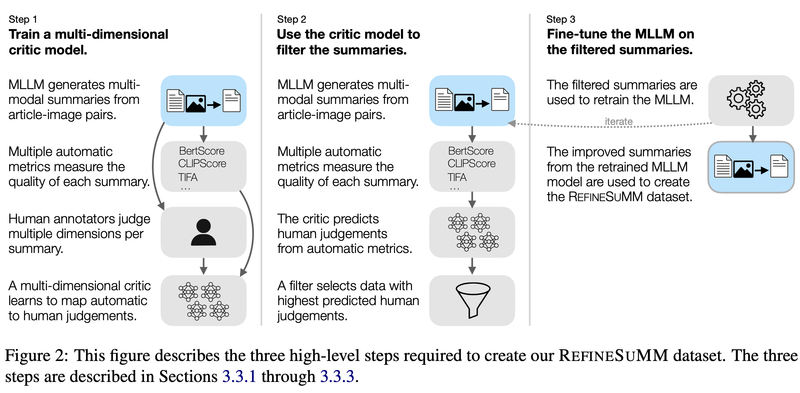

# **REFINESUMM: Self-Refining MLLM for Generating a Multimodal Summarization Dataset**

The **REFINESUMMM** dataset is a comprehensive benchmark designed for training and evaluating Vision-Language models aimed at **image-text multimodal summarization**. This dataset includes triplets of text, related image and summaries based on sections of Wikipedia articles and their accompanying images. These summaries are created automatically by a multimodal LLM, specifically **LLaVA-v1.6-Mistral-7B**, which has been *self-refined* for this task. Given an article and a related image, the goal of the task is to get a concise summary that coherently integrates and faithfully reflects the information from both the article and the image.

---


## **Quick Links**

- 📄 [**Paper**](https://aclanthology.org/2024.acl-long.743/): In-depth details about the REFINESUMM dataset, including its creation process and significance for advancing multimodal summarization.
- 📦 [**Dataset on Hugging Face**](https://huggingface.co/datasets/vaidehi99/RefineSumm): Direct access to download the REFINESUMM dataset for your own research and experimentation.
- 𝕏 [**Summary on X**](https://x.com/vaidehi_patil_/status/1823174854469673445): A brief overview and key takeaways from the project shared on X.

---

## **Loading the Dataset**

To load the REFINESUMM dataset by retrieving the articles and images from WikiWeb2M and the corresponding summaries from [huggingface](ttps://huggingface.co/datasets/vaidehi99/RefineSumm), you can use the following code snippet:

Download the test split of [WikiWeb2M](https://github.com/google-research-datasets/wit/blob/main/wikiweb2m.md)

```python
wget https://storage.googleapis.com/gresearch/wit/wikiweb2m/wikiweb2m-test.tfrecord.gz
```

Place it inside ```data/``` directory

Set split to one of ```train```, ```val```, ```test``` in Line 12 of ```python update_data_from_wikiweb2m.py```

Run 
```python
python update_data_from_wikiweb2m.py
```
The corresponding split of the dataset will be saved in ```data/``` directory.
The columns ```txt``` and ```img``` corresponding to the input article and image and ```summary``` column corresponds to the summary generated using self-refinement.


## Citing Our Work

If you find our codebase and 
dataset beneficial, please cite our work:
```
@inproceedings{patil-etal-2024-refinesumm,
    title = "{REFINESUMM}: Self-Refining {MLLM} for Generating a Multimodal Summarization Dataset",
    author = "Patil, Vaidehi  and
      Ribeiro, Leonardo  and
      Liu, Mengwen  and
      Bansal, Mohit  and
      Dreyer, Markus",
    editor = "Ku, Lun-Wei  and
      Martins, Andre  and
      Srikumar, Vivek",
    booktitle = "Proceedings of the 62nd Annual Meeting of the Association for Computational Linguistics (Volume 1: Long Papers)",
    month = aug,
    year = "2024",
    address = "Bangkok, Thailand",
    publisher = "Association for Computational Linguistics",
    url = "https://aclanthology.org/2024.acl-long.743",
    pages = "13773--13786",
    abstract = "Multimodal Large Language Models (MLLMs) excel at synthesizing key information from diverse sources. However, generating accurate and faithful multimodal summaries is challenging, primarily due to the lack of appropriate multimodal datasets for fine-tuning that meaningfully integrate textual and visual modalities. To address this gap, we present a new dataset designed specifically for image-text multimodal summarization, harnessing the capabilities of state-of-the-art MLLMs. We generate summaries from Wikipedia sections and corresponding images and evaluate them across text-based, visual and multimodal dimensions, employing reference-free metrics. To refine the dataset, we: (1) Filter the MLLM-generated summaries by training a critic model on human annotations and using its predictions to remove low-quality summaries; (2) Fine-tune the MLLM with the filtered high-quality summaries; (3) Use the fine-tuned model in turn to regenerate the summaries. This self-refinement process significantly improves summary quality, as measured by human judgements and automatic multimodal metrics, resulting in a valuable dataset for multimodal summarization research. The dataset is publicly available at https://github.com/amazon-science/refinesumm.",
}
```
